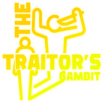

<h1 align="center">
    </img>
    
The Traitor's Gambit (TTG)

</h1>
<h5 align="center">
    A game of a copycat version of "Among Us".
</h5>

## 🔖 Description
It is a game with an idea based on the game "[Among Us](https://www.innersloth.com/games/among-us/)" but with some different mechanisms, the purpose of making this game is to elaborate the practical work part 2 for the subject "_[Game Development Techniques](https://web.ipca.pt/guiaects/main/getpdf/uc/10503/lang/en)_" (GDT) of the course of "_[Digital Games Development Engineering](https://est.ipca.pt/en/curso/digital-games-development/)_" (DGDE), proposed by the teacher Daniel Nogueira.

## 🕹 Game
The game is very simple, if you are a citizen, you just have to find out who the traitor is and thus expel him from the town. If you are a traitor, the goal is to deceive the people by getting them to expel themselves or even eliminate them.

### ⌨️ Keys
The keys are very simple, you only play with the keyboard and don't require a mouse to do the actions, when there are multiple actions in a short space, you can click "_Tab_" to alternate the actions. Here is a list of the keys that the game has:
* **WASD**: To control the character
* **Tab**: To switch the actions
* **E**: To activate the selected action

### ⚙️ Development
In this game contains the base game located in the "[Game](TTG-Game)" folder and then also contains the server part which is located in the "[Server](TTG-Server)" folder, the "[Shared](TTG-Shared)" is for sharing packets and the like so as not to duplicate code and to be reusable between the game and server.

> All the content of the graphic design / audio part was not made by me, I just downloaded them from the internet to have something as an example and not to waste too much time with the design. If you are interested in continuing with this project, you are welcome to fork and change it to your liking.

## 🤝 Contributing
This project will always remain open source and any kind of contribution is welcome. By participating in this project, you agree to keep common sense and contribute in a positive way.

## 📝 License
Copyright © 2023 [João Fernandes](https://github.com/0rangeFox).  
This project is [MIT](LICENSE) licensed.